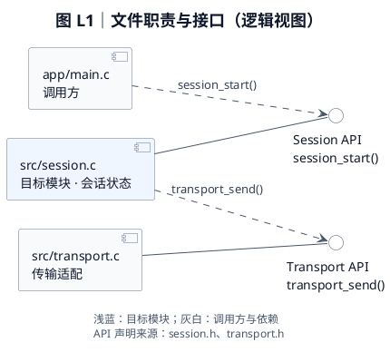
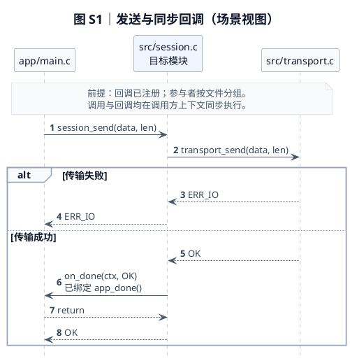

# 专业工程图样式预览

以下是虚构 C 模块的建模和视觉示例，用于检查技能的默认风格；不描述你的实际代码库。正式学习文档仍只需保存 PlantUML 图代码。

## 逻辑视图：区分模块职责、接口契约和声明来源。

```plantuml
@startuml
skinparam backgroundColor #FFFFFF
skinparam shadowing false
skinparam defaultFontName "Microsoft YaHei"
skinparam defaultFontSize 14
skinparam defaultFontColor #0F172A
skinparam titleFontColor #0F172A
skinparam titleFontSize 18
skinparam ArrowColor #475569
skinparam ArrowFontColor #334155
skinparam ArrowFontSize 13
skinparam ArrowThickness 1
skinparam NoteBackgroundColor #F8FAFC
skinparam NoteBorderColor #CBD5E1
skinparam NoteFontColor #475569
skinparam NoteFontSize 13
skinparam LegendBackgroundColor #FFFFFF
skinparam LegendBorderColor #FFFFFF
skinparam LegendFontColor #475569
skinparam LegendFontSize 12
skinparam componentStyle uml2
skinparam componentBackgroundColor #F8FAFC
skinparam componentBorderColor #64748B
skinparam interfaceBackgroundColor #FFFFFF
skinparam interfaceBorderColor #475569
skinparam nodesep 32
skinparam ranksep 36
title 图 L1｜文件职责与接口（逻辑视图）
left to right direction
component "app/main.c\n调用方" as M_APP
component "src/session.c\n目标模块 · 会话状态" as M_SESSION #EFF6FF
interface "Session API\nsession_start()" as I_SESSION
interface "Transport API\ntransport_send()" as I_TRANSPORT
component "src/transport.c\n传输适配" as M_TRANSPORT
M_APP ..> I_SESSION : session_start()
M_SESSION -- I_SESSION
M_SESSION ..> I_TRANSPORT : transport_send()
M_TRANSPORT -- I_TRANSPORT
legend bottom
浅蓝：目标模块；灰白：调用方与依赖
API 声明来源：session.h、transport.h
endlegend
@enduml
```

## 场景视图：区分同步调用、返回与回调，使用真实语义的分支。

```plantuml
@startuml
skinparam backgroundColor #FFFFFF
skinparam shadowing false
skinparam defaultFontName "Microsoft YaHei"
skinparam defaultFontSize 14
skinparam defaultFontColor #0F172A
skinparam titleFontColor #0F172A
skinparam titleFontSize 18
skinparam ArrowColor #475569
skinparam ArrowFontColor #334155
skinparam ArrowFontSize 13
skinparam ArrowThickness 1
skinparam NoteBackgroundColor #F8FAFC
skinparam NoteBorderColor #CBD5E1
skinparam NoteFontColor #475569
skinparam NoteFontSize 13
skinparam LegendBackgroundColor #FFFFFF
skinparam LegendBorderColor #FFFFFF
skinparam LegendFontColor #475569
skinparam LegendFontSize 12
skinparam sequenceParticipantBackgroundColor #F8FAFC
skinparam sequenceParticipantBorderColor #64748B
skinparam sequenceLifeLineBorderColor #94A3B8
skinparam sequenceLifeLineBackgroundColor #EFF6FF
skinparam sequenceArrowColor #475569
skinparam sequenceArrowFontSize 13
skinparam sequenceGroupBackgroundColor #F8FAFC
skinparam sequenceGroupBodyBackgroundColor #FFFFFF
skinparam sequenceGroupBorderColor #94A3B8
skinparam sequenceGroupFontColor #0F172A
skinparam sequenceMessageAlign left
title 图 S1｜发送与同步回调（场景视图）
hide footbox
autonumber
participant "app/main.c" as APP
participant "src/session.c\n目标模块" as SESSION #EFF6FF
participant "src/transport.c" as TRANSPORT
note over APP, TRANSPORT
前提：回调已注册；参与者按文件分组。
调用与回调均在调用方上下文同步执行。
end note
APP -> SESSION : session_send(data, len)
SESSION -> TRANSPORT : transport_send(data, len)
alt 传输失败
  TRANSPORT --> SESSION : ERR_IO
  SESSION --> APP : ERR_IO
else 传输成功
  TRANSPORT --> SESSION : OK
  SESSION -> APP : on_done(ctx, OK)\n已绑定 app_done()
  APP --> SESSION : return
  SESSION --> APP : OK
end
@enduml
```

